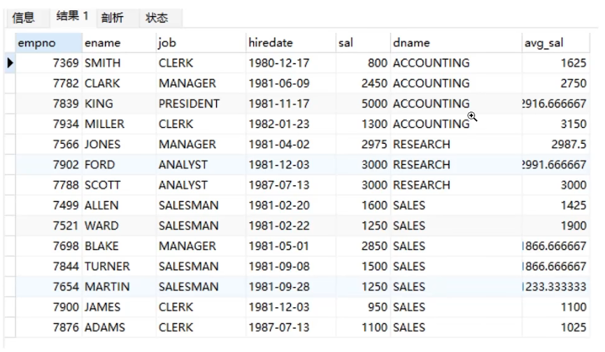
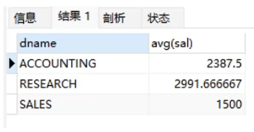
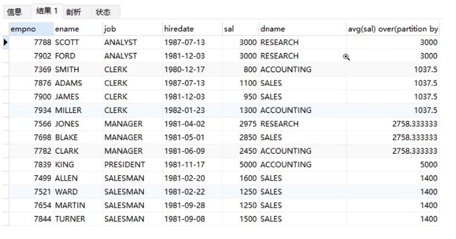
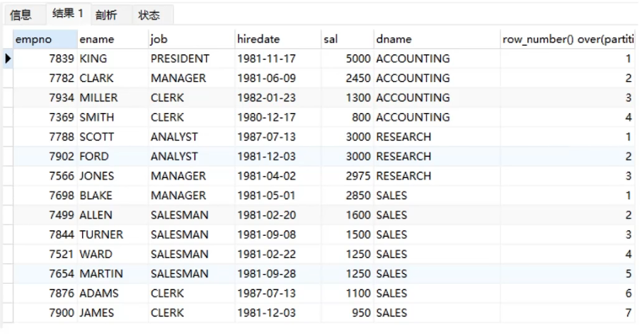
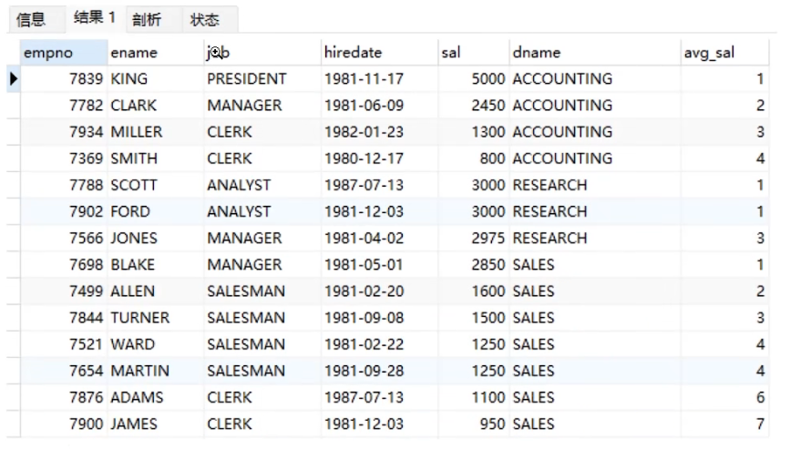
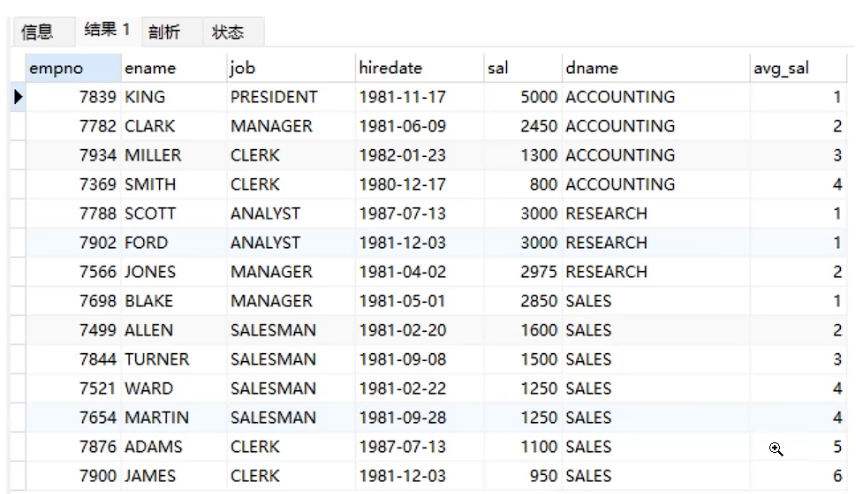

# MySQL开窗函数

其实，开窗函数是在MySQL8.0以后才新加的功能，因此，要想直接使用开窗函数，则sql版本要8.0以上。其实开窗函数是在满足某种条件的记录集合上执行的特殊函数。对于每条记录都要在此窗口内执行函数，有的函数随着记录不同，窗口大小都是固定的，这种属于静态窗口；有的函数则相反，不同的记录对应着不同的窗口，这种动态变化的窗口叫滑动窗口。开窗函数的本质还是聚合运算，只不过它更具灵活性，它对数据的每一行，都使用与该行相关的行进行计算并返回计算结果。接下来，我们介绍开窗函数的相关语法；具体语法如下：
`开窗函数名([<字段名>]) over([partition by <分组字段>] [order by <排序字段> [desc]] [<细分窗口>])`
* partition by子句：按照指定字段进行分区，两个分区由边界分隔，开窗函数在不同的分区内分别执行，在跨越分区边界时重新初始化。
* order by子句：按照指定字段进行排序，开窗函数将按照排序后的记录顺序进行编号。可以和partition by子句配合使用，也可以单独使用。
* frame子句：当前分区的一个子集，用来定义子集的规则，通常用来作为滑动窗口使用。
## 案例说明

### 需求：按部门统计以入司时间升序分析与相邻两名员工的平均工资
结果预览

## 什么是开窗函数
```sql
-- 统计每个部门的平均工资
select dname, avg(sal) from employee group by dname;
```

```sql
-- 为每一位员工附加部门的平均工资
select *, avg(sal) over(partition by job) from employee;
```

```sql
-- 按入司时间降序统计每个部门员工的工资累加值
select *, sum(sal) over(partition by dname order by hiredate desc) avg_sal from employee;
```

```sql
-- 按入司时间升序统计相邻两个员工的平均工资
select *, avg(sal) over(partition by dname order by hiredate rows between 1 preceding and 1 following) avg_sal from employee;
```

```sql
-- 分析每个部门按工资降序的记录行号
select *, row_number() over(partition by dname order by sal desc) from employee;
```

```sql
-- 分析每个部门按工资降序的员工排名，跳跃排名
select *, rank() over(partition by dname order by sal desc) avg_sal employee;
```

```sql
-- 分析每个部门按工资降序的员工排名，连续排名
select *, dense_rank() over(partition by dname order by sal desc) avg_sal employee;
```

```sql
-- 分析每个窗口按入司时间升序与次位薪资差
select *, (curr_sal - next_sal) diff from(
	select *, 
		first_value(sal) over(partition by dname order by hiredate rows between 0 preceding and 1 following) curr_sal,
		last_value(sal) over(partition by dname order by hiredate rows between 0 preceding and 1 following) next_sal
	from employee
) r;
```

