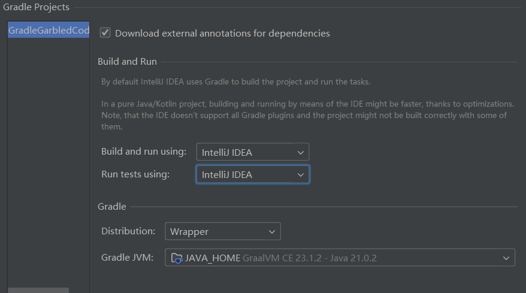

# Gradle 项目中文乱码解决方案

> 本次实验中，IDEA 中所有编码(encoding)设置均为 UTF-8

## 方法一：不通过 Gradle Wrapper 运行，通过 IntelliJ IDEA 运行

1. 打开 IntelliJ IDEA，选择 `File -> Settings -> Build, Execution, Deployment -> Build Tools -> Gradle`

2. 将 `Build and run using` 和 `Run tests using` 下拉修改为 `IntelliJ IDEA`, 如下图


3. 后续在此项目下运行单个文件时，将会在 IDEA 中直接运行，不通过 Gradle 进行构建，编译完成后，此时项目下会出现 `out` 的文件夹，此为 IDEA 的构建输出目录

## 方法二：在 IntelliJ IDEA 中使用 Gradle Wrapper 运行 （推荐）

1. 打开 IntelliJ IDEA，选择 `Help -> Edit Custom VM Options`，在其内容中追加一行 `-Dfile.encoding=UTF-8`

2. 项目中 `build.gradle` 文件添加下面代码

    ```groovy
    tasks.withType(JavaCompile).configureEach {
        options.encoding = "UTF-8"
    }

    // 添加测试任务
    tasks.register('runTest', JavaExec.class) {
        group = 'exec'

        // 设置主类的全限定名
        mainClass = 'com.reine.Main'
        // 设置类路径
        classpath = sourceSets.main.runtimeClasspath

        // 如果需要，可以添加 JVM 参数
    //    jvmArgs = ['-Dfile.encoding=UTF-8']
    }
    ```

3. 项目中 `gradle.properties` 文件中添加以下代码（文件不存在则自行创建文件）

    ```properties
    org.gradle.jvmargs=-Dfile.encoding=GBK
    ```

4. 执行测试任务 `./gradlew runTest`, 输出

    ```shell
    > Task :runTest
    Hello world!
    你好世界
    sun.stdout.encoding = null
    sun.stderr.encoding = null
        native.encoding = GBK
        file.encoding = GBK
    ```

## 方法二：在 Ternimal 中使用 Gradle Wrapper 运行 （推荐）

1. 增加环境变量 `GRADLE_OPTS`，值为 `-Dfile.encoding=GBK`

2. 项目中 `build.gradle` 文件添加下面代码

    ```groovy
    tasks.withType(JavaCompile).configureEach {
        options.encoding = "UTF-8"
    }

    // 添加测试任务
    tasks.register('runTest', JavaExec.class) {
        group = 'exec'

        // 设置主类的全限定名
        mainClass = 'com.reine.Main'
        // 设置类路径
        classpath = sourceSets.main.runtimeClasspath

        // 如果需要，可以添加 JVM 参数
    //    jvmArgs = ['-Dfile.encoding=UTF-8']
    }
    ```

4. 执行测试任务 `./gradlew runTest`, 输出

    ```shell
    > Task :runTest
    Hello world!
    你好世界
    sun.stdout.encoding = null
    sun.stderr.encoding = null
        native.encoding = GBK
        file.encoding = GBK
    ```

## 番外：环境变量 GRADLE_USER_HOME 的作用

* `GRADLE_USER_HOME` 是 Gradle 的用户目录，用于存储 Gradle 的缓存、日志和其他临时文件。默认情况下，Gradle 会使用 `~/.gradle` 目录来存储这些文件，但是可以通过设置 `GRADLE_USER_HOME` 环境变量来指定一个自定义的目录。

* `GRADLE_USER_HOME` 中可以放一些通用的配置文件，脚本（如 `gradle.properties`, `init.gradle`），在每一次执行 Gradle 命令时，都会应用这些配置文件

* 综上所述，我们可以将方案二中的 `gradle.properties` 文件放到 `GRADLE_USER_HOME` 目录下，这样就可以在全局范围内使用该配置文件了
