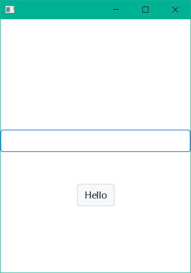

# 几种常用的 JavaFX 组件库或样式

## AtlantaFX

> Modern JavaFX CSS theme collection with additional controls.

* [仓库主页](https://github.com/mkpaz/atlantafx)

* [使用文档](https://mkpaz.github.io/atlantafx/reference/controls/)

### 示例代码

1. 引入依赖

   ```xml
   <dependency>
     <groupId>io.github.mkpaz</groupId>
     <artifactId>atlantafx-base</artifactId>
     <version>2.0.0</version>
   </dependency>    
   ```

2. 引入模块，在 `module-info.java` 中声明下列语句

   ```java
   requires atlantafx.base;
   ```

3. 主程序代码

   ```java
   public class AtlantaFXSample extends Application {
     @Override
     public void start(Stage primaryStage) throws Exception {
         // 使用样式
         Application.setUserAgentStylesheet(new PrimerLight().getUserAgentStylesheet());
   
         VBox root = new VBox(20);
         root.setAlignment(Pos.CENTER);
   
         HBox accountBox = new HBox(10);
         accountBox.setAlignment(Pos.CENTER);
         Label accountLabel = new Label("账号: ");
         accountLabel.setStyle("-fx-pref-width: 50; -fx-font-size: 15");
         TextField accountField = new TextField();
         accountField.setPromptText("请输入账号");
         accountField.setStyle("-fx-pref-width: 200");
         accountBox.getChildren().addAll(accountLabel, accountField);
   
         HBox passwordBox = new HBox(10);
         passwordBox.setAlignment(Pos.CENTER);
         Label passwordLabel = new Label("密码: ");
         passwordLabel.setStyle("-fx-pref-width: 50; -fx-font-size: 15");
         PasswordTextField passwordFiled = new PasswordTextField();
         passwordFiled.setPromptText("请输入密码");
         passwordFiled.setStyle("-fx-pref-width: 200");
         passwordBox.getChildren().addAll(passwordLabel, passwordFiled);
   
         Button button = new Button("登录");
         button.setStyle("-fx-pref-width: 250");
         // 设置样式类名
         button.getStyleClass().addAll("accent", "large");
   
         root.getChildren().addAll(accountBox, passwordBox, button);
   
         Scene scene = new Scene(root, 300, 400);
   
         primaryStage.setScene(scene);
         primaryStage.show();
     }
   }    
   ```

4. 效果
    
   


## JMetro

> JavaFX themes / styles that can be used to give applications a different look and feel.

* [仓库主页](https://github.com/JFXtras/jfxtras-styles)

### 示例代码

1. 引入依赖

   ```xml
   <dependency>
     <groupId>org.jfxtras</groupId>
     <artifactId>jmetro</artifactId>
     <version>11.6.16</version>
     <exclusions>
         <exclusion>
             <groupId>org.openjfx</groupId>
             <artifactId>javafx-graphics</artifactId>
         </exclusion>
     </exclusions>
   </dependency>
   
   <!--引入对应版本的graphics包-->
   <dependency>
     <groupId>org.openjfx</groupId>
     <artifactId>javafx-graphics</artifactId>
     <version>${jfx.version}</version>
   </dependency>    
   ```

2. 引入模块，在 `module-info.java` 中声明下列语句

   ```java
   requires org.jfxtras.styles.jmetro;
   ```

3. 主程序代码

   ```java
   public class JMetroSample extends Application {
     @Override
     public void start(Stage primaryStage) throws Exception {
         System.setProperty("prism.lcdtext", "false");// 可以不加
   
         VBox root = new VBox(20);
         root.setAlignment(Pos.CENTER);
   
         HBox accountBox = new HBox(10);
         accountBox.setAlignment(Pos.CENTER);
         Label accountLabel = new Label("账号: ");
         accountLabel.setStyle("-fx-pref-width: 50; -fx-font-size: 15");
         TextField accountField = new TextField();
         accountField.setPromptText("请输入账号");
         accountField.setStyle("-fx-pref-width: 200");
         accountBox.getChildren().addAll(accountLabel, accountField);
   
         HBox passwordBox = new HBox(10);
         passwordBox.setAlignment(Pos.CENTER);
         Label passwordLabel = new Label("密码: ");
         passwordLabel.setStyle("-fx-pref-width: 50; -fx-font-size: 15");
         PasswordField passwordFiled = new PasswordField();
         passwordFiled.setPromptText("请输入密码");
         passwordFiled.setStyle("-fx-pref-width: 200");
         passwordBox.getChildren().addAll(passwordLabel, passwordFiled);
   
   
         Button button = new Button("登录");
         button.setStyle("-fx-pref-width: 250");
   
         root.getChildren().addAll(accountBox, passwordBox, button);
         Scene scene = new Scene(root, 300, 400);
         JMetro jMetro = new JMetro(scene, Style.LIGHT); // 引入样式
         primaryStage.setScene(scene);
         primaryStage.show();
     }
   }    
   ```

4. 效果

   

## MaterialFX

> A library of material components for JavaFX

* [仓库主页](https://github.com/palexdev/MaterialFX)

* [使用文档](https://github.com/palexdev/MaterialFX/wiki)

### 示例代码

1. 引入依赖

   ```xml
   <dependency>
     <groupId>io.github.palexdev</groupId>
     <artifactId>materialfx</artifactId>
     <version>11.17.0</version>
   </dependency>    
   ```

2. 引入模块，在 `module-info.java` 中声明下列语句

   ```java
   requires MaterialFX;
   ```

3. 主程序代码

   ```java
   public class MaterialFXSample extends Application {
     @Override
     public void start(Stage primaryStage) throws Exception {
         // 引入样式
         UserAgentBuilder.builder()
                 .themes(JavaFXThemes.MODENA)
                 .themes(MaterialFXStylesheets.forAssemble(true))
                 .setDeploy(true)
                 .setResolveAssets(true)
                 .build()
                 .setGlobal();
   
         VBox root = new VBox(20);
         root.setAlignment(Pos.CENTER);
   
         HBox accountBox = new HBox(10);
         accountBox.setAlignment(Pos.CENTER);
         Label accountLabel = new Label("账号");
         MFXTextField accountField = new MFXTextField();
         accountField.setPromptText("请输入账号");
         accountField.setStyle("-fx-pref-width: 200; -fx-pref-height: 10");
         accountBox.getChildren().addAll(accountLabel, accountField);
   
         HBox passwordBox = new HBox(10);
         passwordBox.setAlignment(Pos.CENTER);
         Label passwordLabel = new Label("密码");
         MFXPasswordField passwordFiled = new MFXPasswordField();
         passwordFiled.setPromptText("请输入密码");
         passwordFiled.setStyle("-fx-pref-width: 200;-fx-pref-height: 10");
         passwordBox.getChildren().addAll(passwordLabel, passwordFiled);
   
   
         MFXButton button = new MFXButton("登录");
         button.setStyle("-fx-pref-width: 200");
   
         root.getChildren().addAll(accountBox, passwordBox, button);
         Scene scene = new Scene(root, 300, 400);
         primaryStage.setScene(scene);
         primaryStage.show();
   
     }
   }
   
   ```

4. 效果

   